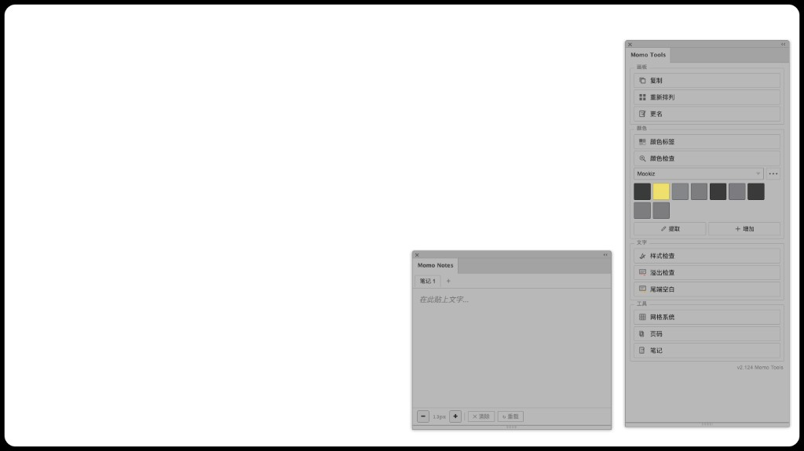

# 🎨 Momo Tools — Adobe Illustrator Extension

[简体中文](README.zh-CN.md) | English



🎨 **Hey — meet Momo Tools**, a friendly Illustrator side panel built by a designer who'd rather click one button than fight native menus all day ✨. **Duplicate artboards with content** 📐, **relayout & batch-rename** boards, **audit colors** 🎨, **manage brand swatches** (CMYK / JSON), **check text styles / overflow / trailing spaces** ✍️, **drop in grids & page numbers** 📏, and jot notes in **Momo Notes** 📝 — all from one cozy panel that follows Illustrator's light / dark theme 🌗. No shortcuts to memorize; click and go.

| | |
|---|---|
| **Download** | [Releases](https://github.com/tomideas/momo-illustrator/releases) — `momo-tools-*.zxp` or `momo-tools-*-cep.zip` |
| **User guide** | [tomideas.github.io/momo-illustrator](https://tomideas.github.io/momo-illustrator/) |
| **Version** | v2.125 · Illustrator 17.0 – 99.9 |

## ✨ Features

- 📐 **Artboards** — duplicate with content (unlike AI native copy), relayout grid, batch rename
- 🏷️ **Color labels** — extract fills from selection, auto-generate swatch callouts
- 🔍 **Color check** — count colors, colored index labels, flag rare colors, legend on artboard
- 🎨 **Color library** — brand palettes, CMYK-first, JSON import/export, survives restarts
- ✍️ **Text style check** — group by size / font / color, flag rare styles & mixed runs
- 📦 **Overflow check** — catch overset area text before print
- 🧹 **Trailing whitespace** — find & clean hidden spaces at line ends
- 📏 **Grid system** — Swiss / equal grids (© canfei / 火山字型)
- 🔢 **Page numbers** — batch numbering across artboards
- 📝 **Momo Notes** — multi-tab scratchpad sidebar (Markdown tables, Cmd+Z undo)

## 📦 Installation

Pick **one** method below. After install, **fully quit and restart** Illustrator.

### Method A — ZXP (recommended)

1. 📥 Download the latest `momo-tools-x.xx.zxp` from [Releases](https://github.com/tomideas/momo-illustrator/releases)
2. 📥 Install [ZXP/UXP Installer](https://aescripts.com/learn/post/zxp-installer) (macOS or Windows)
3. 📂 Drag the `.zxp` into the installer window
4. 🔄 Restart Illustrator
5. 🎨 **macOS**: `Window` → `Extensions` → `Momo Tools` · **Windows**: `Window` → `Extensions` → `Momo Tools`

> Step-by-step screenshots & video: [User guide → Install](https://tomideas.github.io/momo-illustrator/#install)

### Method B — Manual (CEP folder)

1. 📥 Download `momo-tools-x.xx-cep.zip` from [Releases](https://github.com/tomideas/momo-illustrator/releases) and unzip `com.tomideas.illustratortools`
2. 📁 Copy the folder into the CEP extensions directory (name must stay `com.tomideas.illustratortools`):

| OS | Path |
|----|------|
| **macOS** | `~/Library/Application Support/Adobe/CEP/extensions/com.tomideas.illustratortools/` |
| **Windows** | `%APPDATA%\Adobe\CEP\extensions\com.tomideas.illustratortools\` |

**Create the folder if missing** (common on first CEP install):

```bash
# macOS
mkdir -p ~/Library/Application\ Support/Adobe/CEP/extensions
open ~/Library/Application\ Support/Adobe/CEP/extensions
```

```cmd
REM Windows
mkdir "%APPDATA%\Adobe\CEP\extensions"
explorer "%APPDATA%\Adobe\CEP\extensions"
```

3. 🔓 **Enable unsigned extensions** (first time only — quit Illustrator first):

```bash
# macOS
defaults write com.adobe.CSXS.11 PlayerDebugMode 1
defaults write com.adobe.CSXS.12 PlayerDebugMode 1
```

```cmd
REM Windows
reg add HKCU\Software\Adobe\CSXS.11 /v PlayerDebugMode /t REG_STRING /d 1 /f
reg add HKCU\Software\Adobe\CSXS.12 /v PlayerDebugMode /t REG_STRING /d 1 /f
```

4. 🔄 Restart Illustrator → open **Momo Tools** from the Extensions menu

### Uninstall

Delete `com.tomideas.illustratortools` from the CEP extensions folder and restart Illustrator. Color library & notes data are stored separately and won't be removed.

## 📖 Documentation

Full user guide (HTML, GitHub Pages):

👉 [tomideas.github.io/momo-illustrator](https://tomideas.github.io/momo-illustrator/)

Source files live in [`site/`](site/). Changelog: [`CHANGELOG.md`](CHANGELOG.md).

## 🗂️ Project Structure

```
momo-illustrator/
├── README.md              # 📄 This file (English)
├── README.zh-CN.md        # 📄 简体中文
├── CHANGELOG.md           # 📋 Version history
├── site/                  # 📖 User guide (GitHub Pages)
│   ├── index.html
│   └── assets/            # Images & demo videos
├── extension/             # 🧩 CEP extension source
│   └── com.tomideas.illustratortools/
│       ├── CSXS/manifest.xml
│       ├── js/              # Panel logic
│       └── jsx/scripts/     # Illustrator scripts
└── scripts/               # 🔧 Release packaging
```

Local-only dev files (`@Reference/`, internal notes, probe scripts) are **not** published to this repo.

## 💾 Color library data

Saved on your machine:

- **macOS**: `~/Library/Application Support/MomoTools/color_library.json`
- **Windows**: `%APPDATA%\MomoTools\`
- Fallback: panel `localStorage`

Use the panel **•••** menu to import / export JSON backups.

## ❓ FAQ

**Can't find Momo Tools in the menu?**  
→ Enable PlayerDebugMode, confirm folder name `com.tomideas.illustratortools`, fully restart AI.

**Colors turn white after restart?**  
→ Keep CMYK and HEX in sync when editing swatches; export JSON backups regularly.

**More help**  
→ [User guide](https://tomideas.github.io/momo-illustrator/) · [FAQ](https://tomideas.github.io/momo-illustrator/#trouble)

---

- **Developer**: Momo (tomideas)
- **License**: See release notes
